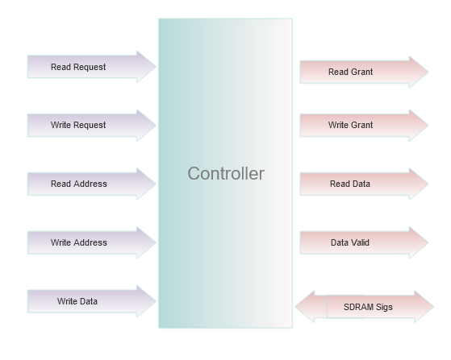

## Synchronous dynamic random-access memory (SDRAM) controller 
SDRAM is dynamic random access memory (DRAM) with a synchronous interface. It means that SDRAM uses a clock while DRAM does not. The interface has the system bus carrying data between the CPU and the memory controller hub. The memory controller will accept memory requests from the CPU, analyze the requests and dispatch them to the SDRAM in an efficient manner. This SDRAM Controller is simple and only one bank is active at a time.

### View of SDRAM controller

## Building on macOS
1. Icarus-Verilog can be installed via Homebrew :
   <code>$ brew install icarus-verilog</code>
2. Download [Scansion](http://www.logicpoet.com/scansion/) from here.  
3. Clone the repository.
4. Run <code>$ make </code> and type MIPS code to see it in binary form in rams_init_file.hex file. 

5. <code>$ make simulate</code> will: 
* compile design+TB
* simulate the verilog design

6. <code>$ make display</code> will: 
*  display waveforms.

## Links 
1. [Design and Verification of SDRAM Controller Based on FPGA](https://www.scirp.org/pdf/jcc_2020070314282156.pdf) 
2. [FPGA VHDL SDRAM Controller](https://dnotq.io/sdram/sdram.html)
